# CGRA 2020/2021 - Group T03G09
| Name             | Number    | E-Mail             |
| ---------------- | --------- | ------------------ |
| Marcelo Couto    | 201906086 |up201906086@fe.up.pt|
| Miguel Loopes    | 201704590 |up201704590@fe.up.pt|

## My Fish
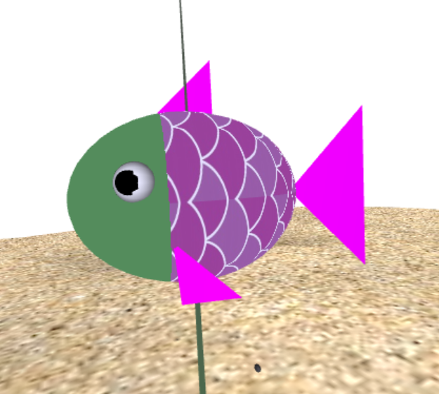
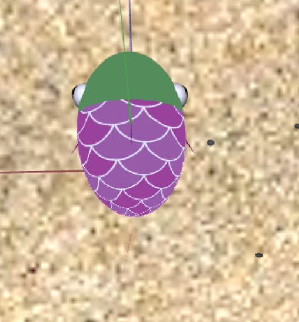
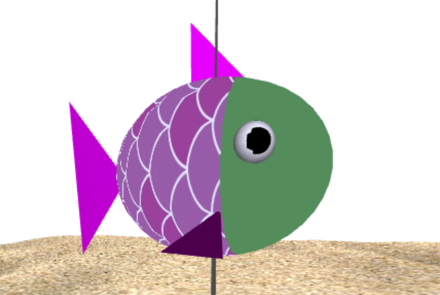

## Nest

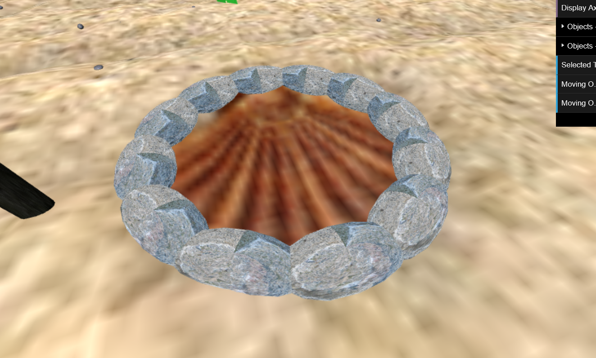

## Water Surface

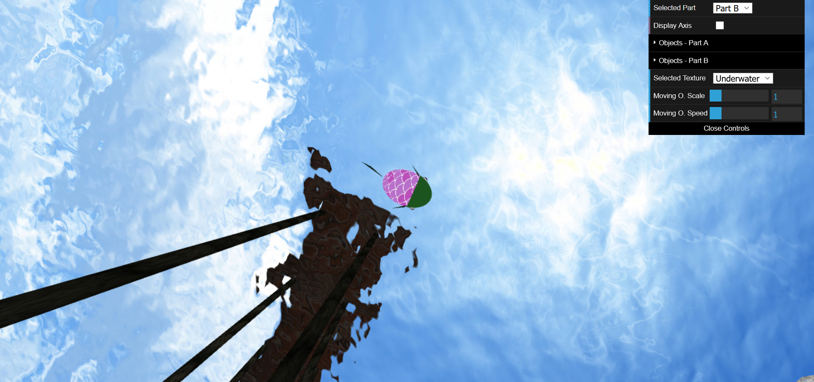

## Rocks

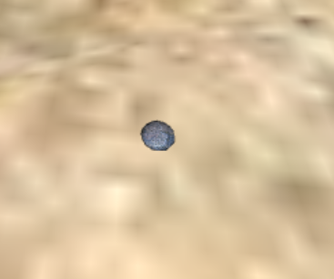
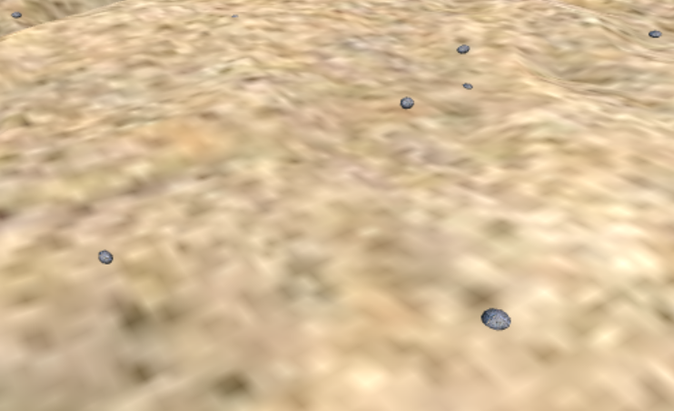

## My Pillar

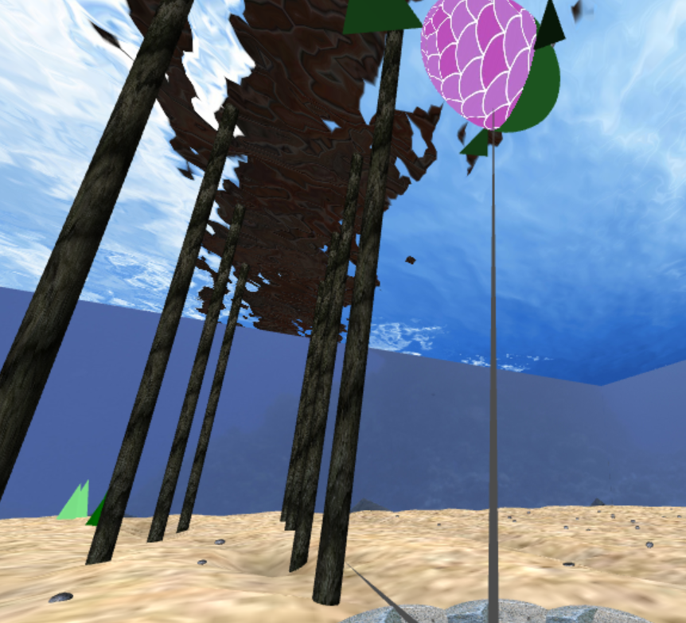
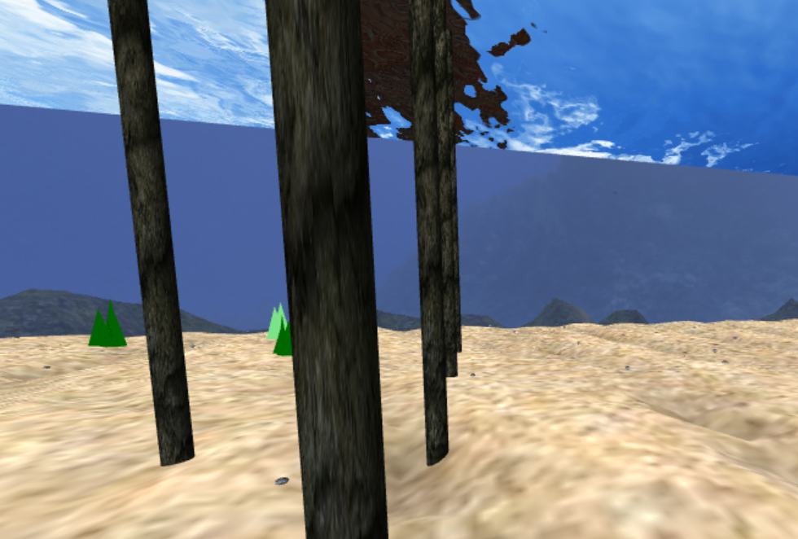

## Other Elements

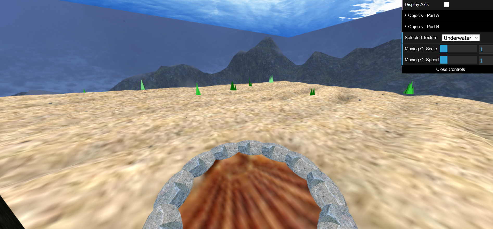
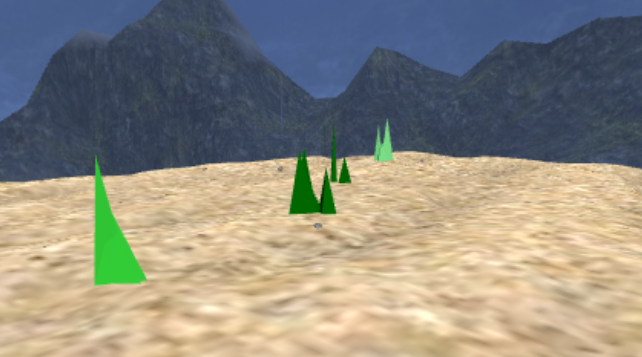

## Picking-up/Dropping Rocks

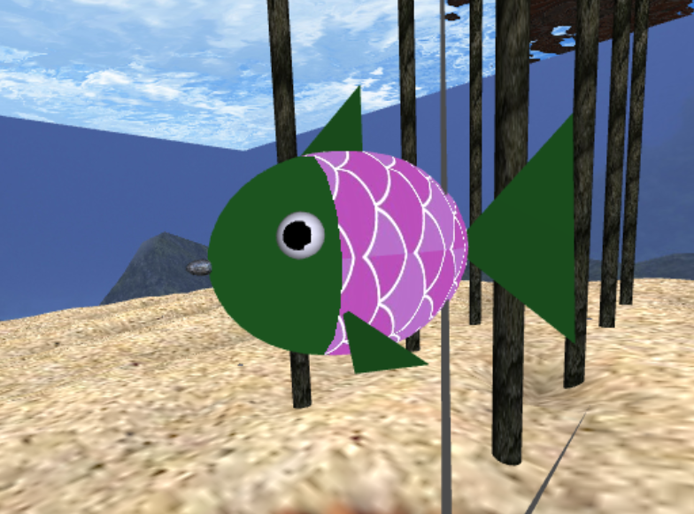
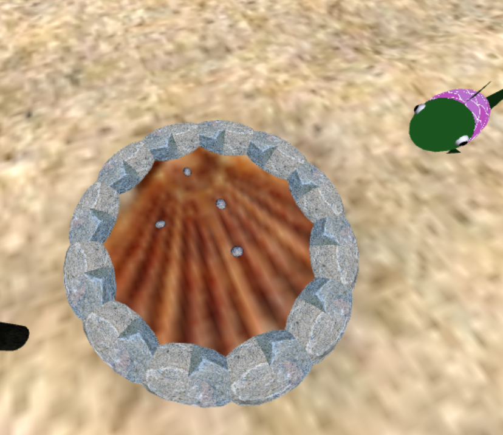

## Aditional Features
Decidimos implementar as features 7.1 - Algas,
7.4 - Lançamento das pedras para o alvo e 7.5 - MyAnimatedFish - Animação de outros peixes

Tal como foi sugerido pelo professor das aulas práticas, uma tentativa de melhorar a performance experimentamos reutilizar o mesmo shader para todos os peixes, no entanto, não verificamos nenhuma melhoria e como tal mantivemos as texturas dos peixes diferentes, como se pode verificar nos screenshots que se seguem:

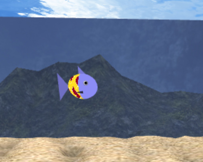
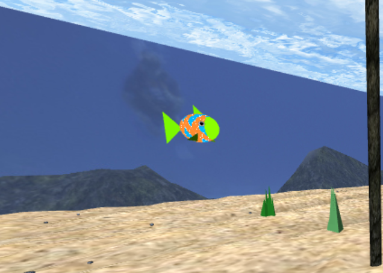
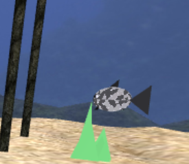

